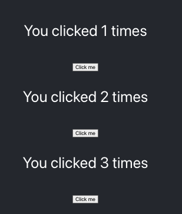
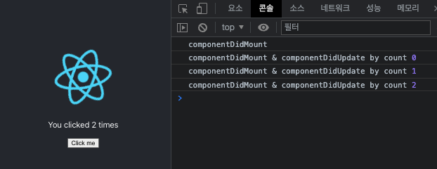
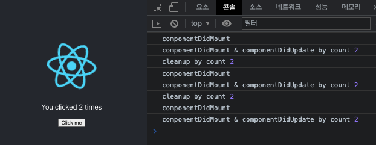

<h1>Ch8. React Testing</h1>

1. Basic Hooks

- Hook (React 16.8 이후 추가)

  - Hook은 Function Component 또는 Hook 안에서만 사용 가능
  - class component에서만 state를 사용하고 라이프사이클을 사용할 수 있었음
  - Hook 개발 이후 function component에서도 사용 가능
  - 컴포넌트의 state와 관련된 로직의 재사용이 가능해졌음

- useState() : state hook : state 대체 가능

  - useState() 이전 : <br/>
    Funtional Component == stateless Component == Stateless Functional Component<br/>

  - useState() 이후 : <br/>
    Funtional Component != stateless Component<br/>

  - useState 개발로 Function Component에서 상태 관리 가능하게 한 이유

    - 컴포넌트 사이의 상태와 관련된 로직의 재사용 어려움
      - 컨테이너 방식이 아닌, 상태와 관련된 로직
    - 복잡한 컴포넌트들은 이해가 어려움
    - class는 사람과 기계를 혼동시킴
      - 컴파일 단계에서 코드를 최적화하기 어렵게 만듦
    - Class Component의 this.state는 로직에서 render() 사이의 레퍼런스를 공유하기때문에 문제 발생 가능
      - render 사이의 변경된 state를 정확하게 표현해야 할때는 좋으나, render 사이의 state를 레퍼런스처럼 사용해야 할때는 좋지 않을 수 있음

  - 적용 예시
    - Example1 : Class Component 사용
    - Example2 : useState()를 활용해 Function Component 사용
    - Example3
      - 방식1 : click()에서 외부 주입받은 state의 count를 변경하여 리턴. 외부 state에 의존적
      - 방식2 : 주입받은 state와 변개의 state를 리턴
      - 방식3 : return을 바로 하므로 (input) => (return) 방식으로 변경

  ```
  /src/compononts/Example1.jsx

  import React from 'react';

  export default class Example1 extends React.Component {
    state = { count: 0 };
    render() {
      const { count } = this.state;

      return (
        <div>
          <p>You clicked {count} times</p>
          <button onClick={this.click}>Click me</button>
        </div>
      );
    }

    click = () => {
      this.setState({ count: this.state.count + 1 });
    };
  }

  ```

  ```
  /src/compononts/Example2.jsx

  import React from 'react';

  // useState => count
  export default function Example2() {
    const [count, setCount] = React.useState(0);
    return (
      <div>
        <p>You clicked {count} times</p>
        <button onClick={click}>Click me</button>
      </div>
    );

    function click() {
      setCount(count + 1);
    }
  }
  ```

  ```
  /src/compononts/Example3.jsx

  import React from 'react';

  // useState => { count: 0 };
  export default function Example3() {
    const [state, setState] = React.useState({ count: 0 });
    return (
      <div>
        <p>You clicked {state.count} times</p>
        <button onClick={click}>Click me</button>
      </div>
    );

    function click() {
      // 방식1과 방식2의 차이는 방식1은 외부의 state에 의존적이지만
      // 방식2는 외부 주입받은 state와는 별개의 state를 리턴하므로
      // 외부 디펜던시에 의존적이지 않다는 장점이 있음
      // 방식3는 방식2와 같으나 return을 바로 할 경우 가능 : (input) => (return)

      // setState({ count: state.count + 1 }); // 방식1

      // 방식2
      // setState((state) => {
      // 	return {
      // 		count: state.count + 1,
      // 	};
      // });

      // 방식3
      setState((state) => ({
        count: state.count + 1,
      }));
    }
  }

  ```

<center>방식별 결과</center>



<br/>

- useEffect() : 라이프사이클 훅의 대체 가능. render와 Dapendency List와 밀접한 관계가 있음

  - 종류

    - componentDidUpdate
    - componentWillUnmount
    - useContext(Context API에서 확인)

  - componentDidMount 처리

    - 방식1 : render 직후 호출
    - 방식2 : count 값을 전달하고자 할때는 3번과 같은 방식으로 사용할 것
    - []는 React.DependencyList를 의미함<br/>
      빈배열 추가 시는 최초 render 직후만 호출

    ```
    /src/components/Example5.jsx

    import React from 'react';

    export default function Example5() {

      const [count, setCount] = React.useState(0);

      // 방식1
      React.useEffect(() => {
        console.log('componentDidMount');
      }, []);

      // 방식2
      React.useEffect(() => {
        console.log('componentDidMount & componentDidUpdate by count', count);
      }, [count]);

      return (
        <div>
          <p>You clicked {count} times</p>
          <button onClick={click}>Click me</button>
        </div>
      );

      function click() {
        setCount(count + 1);
      }
    }

    ```

  <center>방식별 결과1</center>

  

  - componentWillUnmount

    - 1번
      - cleanup : componentDidMount 출력 시점은 렌더가 된 직후이므로 다음 렌더가 실행되기 직전의 시점을 의미
      - componentWillUnmount : 이 케이스는 dependencylist가 없으므로 최초 렌더 시점만 실행되므로 결론적으로 componentWillUnmount 역할을 함
    - 2번
      - cleanup : nextComponentDidupdate가 되기 직전에 정리하는 부분
      - 이 부분의 count는 이전 count로 render 되기 전에 이전 count 값을 출력 후 render 후
        return 위의 componentDidMount & componentDidUpdate by count의 새로운 count 값을 출력한다.

    ```
    /src/components/Example5.jsx

    import React from 'react';

    export default function Example5() {
      const [count, setCount] = React.useState(0);

      // 1번
      React.useEffect(() => {
        console.log('componentDidMount');

        return () => {
          // cleanup
          // componentWillUnmount 역할
        };
      }, []);

      // 2번
      React.useEffect(() => {
        console.log('componentDidMount & componentDidUpdate by count', count);

        return () => {
          // cleanup
          // componentWillUnmount 역할
          console.log('cleanup by count', count);
        };
      }, [count]);

      return (
        <div>
          <p>You clicked {count} times</p>
          <button onClick={click}>Click me</button>
        </div>
      );

      function click() {
        setCount(count + 1);
      }
    }

    ```

    <center>방식별 결과2</center>

    

  - useEffect() 작동방식 추가 설명

    - C : Component
    - R : React
    - B : Browser

    - 첫 번째 Rendering

      1. R -> C : state가 0일 때 UI 생성 지시
      2. C -> R : rendering 결과물 `<p>You clicked {count} times</p>` 전달<br/>
         모든 처리 후 아래 effect 실행 지시<br/>
         () => {document.title = 'You clicked 0 times'}
      3. R -> B : DOM 추가 요청
      4. B -> R : 화면에 DOM 추가
      5. () => {document.title = 'You clicked 0 times'} 이펙트 실행

    - 클릭 후 Rendering

      1. C -> R : 상태 1로 변경 요청
      2. R -> C : 상태 1일 때의 UI 요청
      3. C -> R : rendering 결과물 `<p>You clicked {count} times</p>` 전달<br/>
         모든 처리 후 아래 effect 실행 지시<br/>
         () => {document.title = 'You clicked 1 times'}
      4. R -> B : DOM 추가 요청
      5. B -> R : 화면에 DOM 추가
      6. () => {document.title = 'You clicked 6 times'} 이펙트 실행

    - 이 후 반복

    ```
    /src/Example6.jsx

    import React from 'react';

    export default function Example6() {
      const [count, setCount] = React.useState(0);

      React.useEffect(() => {
        document.title = `You Clicked ${count} times`;
      });

      function click() {
        setCount(count + 1);
      }

      return (
        <div>
          <p>You clicked {count} times</p>
          <button onClick={click}>Click me</button>
        </div>
      );
    }

    ```

<br/><br/>

2. Custom Hooks

- useSomthing

  1. useWindowWidth() : 브라우저의 가로창 사이즈 변경 데이터 받아오는 Hook 만들기

  ```
  /src/hooks/useWindowWidth.js

  import { useEffect, useState } from 'react';

  export default function useWindowWidth() {

    const [width, setWidth] = useState(window.innerWidth);

    useEffect(() => {
      const resize = () => {
        setWidth(window.innerWidth);
      };

      // Class Component의 componentDidMount 부분
      window.addEventListener('resize', resize);

      return () => {
        // Class Component의 componentWillUnmount 부분
        window.removeEventListener('resize', resize);
      };
    }, []);

    return width;
  }

  ```

  - 최초의 윈도우 가로 사이즈 값 가져오기 : useState(window.innerWidth)
  - useEffect()의 cleanup 부분인 return()에서 nextComponentDidupdate가 되기전에<br/>
    resize를 정리하기 위해 resize에 함수를 담아 사용하는 것

  <br/>

  - App.js에 적용

  ```
  function App({ hasMounted }) {
    const width = useWindowWidth();

    const hasMountedFromHooks = useHasMounted();

    console.log(hasMounted, hasMountedFromHooks);

    return (
      <div className="App">
        <header className="App-header">
          
          {width}
        </header>
      </div>
    );
  }

  ```

- withHasMounted(HOC) VS useHasMounted(Hook)

  1. withHasMounted(HOC)

  ```
  /src/hocs/withHasMounted.jsx

  import React from 'react';

  export default function withHasMounted(Component) {
    class NewComponent extends React.Component {
      state = {
        hasMounted: false,
      };

      render() {
        const { hasMounted } = this.state;
        return <Component {...this.props} hasMounted={hasMounted} />;
      }

      componentDidMount() {
        this.setState({ hasMounted: true });
      }
    }

    NewComponent.displayName = `withHasMounted(${Component.name})`;

    return NewComponent;
  }

  ```

  <br/>
    - App.js에 적용
      - input으로 {hasMounted} 주입
      - export 시점에 App -> withHasMounted(App);

  ```
  /App.js

  function App({ hasMounted }) {

    console.log(hasMounted, hasMountedFromHooks);

    return (
      <div className="App">
        <header className="App-header">
          
          {width}
        </header>
      </div>
    );
  }

  export default withHasMounted(App);

  ```

  - 실행결과가 false 출력 후 true로 변경됨
  - 그 이유는 App Component가 초기값이 false인 상태로 render 되었다가 props가 true로 변경 후 다시 render 되었기 때문
  - props 변경 시 Component는 다시 render됨

  2. useHasMounted (Hook)

  - useEffect() 내부 ", []" 부분은 최초 렌더 시점만 실행하라는 뜻

  ```
  import { useEffect, useState } from 'react';

  export default function useHasMounted() {
    const [hasMounted, setHasMounted] = useState(false);

    useEffect(() => {
      setHasMounted(true);
    }, []);

    return hasMounted;
  }

  ```

  - App.js에 적용

  ```
  import useHasMounted from './hooks/useHasMounted';

  function App({ hasMounted }) {

    const hasMountedFromHooks = useHasMounted();

    console.log(hasMounted, hasMountedFromHooks);

    return (
      <div className="App">
        <header className="App-header">
          
        </header>
      </div>
    );
  }

  export default withHasMounted(App);

  ```

- withHasMounted는 props로 useHasMounted는 상태 변경 로직을 리턴하는 것
- 요즘은 Hook을 대부분 더 많이 사용함

<br/><br/>

3. Additional Hooks

- useRef(), useCallback(), Memo() : render 사이의 상태를 유지하는 기능

  - Class Component에서는 render 함수만 계속 실행되므로 나머지는 계속 유지되므로 이런 것들을 신경쓸 필요가 없음
  - 그러나 Function Component는 모두 새로 생성되므로 render 사이에 새로 생성될 필요 없이 유지되도록 만들어 주는 함수들

- useReducer

  - 다수의 하위값을 포함하는 복잡한 정적 로직을 만드는 경우
  - 다음 state가 이전 state에 의존적인 경우
  - Redux를 알 시 쉽게 사용 가능

  ```
  import { useReducer } from 'react';

  // reducer => state를 변경하는 로직이 담겨있는 함수
  const reducer = (state, action) => {
    if (action.type === 'PLUS') {
      return {
        count: state.count + 1,
      };
    }
    return state;
  };

  // dispatch => action 객체를 넣어서 실행

  // action => 객체이고 필수 프로퍼티로 type을 가진다.

  export default function Example7() {
    const [state, dispatch] = useReducer(reducer, { count: 0 });
    return (
      <div>
        <p>You clicked {state.count} times</p>
        <button onClick={click}>Click me</button>
      </div>
    );

    function click() {
      dispatch({ type: 'PLUS' });
    }
  }

  ```

- useMemo, useCallback

  - const 디펜던시 변경이 없으면 고정
  - 함수가 매번 새로 생성되는 경우, 최적화가 어려움
  - 아래 케이스도 value가 매번 변경 시마다 component가<br/>
    계속 render되므로 그때마다 sum 함수를 계속 실행하면 최적화 필요성이 있음

  ```
  /src/components/Example8.jsx

  import { useCallback, useMemo, useState } from 'react';

  function sum(people) {
    console.log('sum...');
    return people.map((person) => person.age).reduce((l, r) => l + r, 0);
  }

  export default function Example8() {
    const [value, setValue] = useState('');
    const [people] = useState([
      { name: 'Mark', age: 39 },
      { name: 'Hayden', age: 40 },
    ]);

    // const count = sum(people); // count는 sum()의 people에 의존적이므로 people가 변경되지 않아도 계속 계산을 다시함. 아래와 같이 변경
    const count = useMemo(() => {
      return sum(people);
    }, [people]);

    const click = useCallback(() => {
      console.log(value);
    }, []);

    return (
      <div>
        {/* 타이핑을 할 시 렌더가 다시 됨 */}
        <input value={value} onChange={change} />
        <p>{count}</p>
        <button onClick={click}>Click</button>
      </div>
    );

    function change(e) {
      setValue(e.target.value);
    }
  }

  ```

- createRef vs useRef

  - createRef() => render 될때마다 input1Ref 다시 만듦
  - useRef() => render 반박되도 input2Ref는 초기화 시점의 것을 사용.
  - 그래서 최소 시점 input2Ref는 undefined가 출력됨

  ```
  /src/components/Example9.jsx

  import { createRef, useRef, useState } from 'react';

  export default function Example9() {
    const [value, setValue] = useState('');
    const input1Ref = createRef();
    const input2Ref = useRef();

    console.log(input1Ref.current, input2Ref.current);

    return (
      <div>
        {/* 타이핑을 할 시 렌더가 다시 됨 */}
        {/* Controlled Component */}
        <input value={value} onChange={change} />
        <input ref={input1Ref} />
        <input ref={input2Ref} />
      </div>
    );

    function change(e) {
      setValue(e.target.value);
    }
  }
  ```

<br/>

4. 컴포넌트간 통신

- 상위 컴포넌트에서 하위 컴포넌트로 데이터 이동

  - A 의 button 를 클릭하여 E 를 변경하려면

  1. `<A />` 컴포넌트에서 button 에 onClick 이벤트를 만들고,
  2. button 을 클릭하면, `<A />` 의 state 를 변경하여, `<B />` 로 내려주는 props 를 변경
  3. `<B />` 의 props 가 변경되면, `<C />` 의 props 에 전달
  4. `<C />` 의 props 가 변경되면, `<D />` 의 props 로 전달
  5. `<D />` 의 props 가 변경되면, `<E />` 의 props 로 전달

  ```
  import { useState } from 'react';

  export default function A() {
    const [value, setValue] = useState('아직 안바뀜');
    return (
      <div>
        <B value={value} />
        <button onClick={click}>E의 값을 바꾸기</button>
      </div>
    );

    function click() {
      setValue('E의 값을 변경');
    }
  }

  function B({ value }) {
    return (
      <div>
        <p>여긴 B</p>
        <C value={value} />
      </div>
    );
  }
  function C({ value }) {
    return (
      <div>
        <p>여긴 C</p>
        <D value={value} />
      </div>
    );
  }
  function D({ value }) {
    return (
      <div>
        <p>여긴 D</p>
        <E value={value} />
      </div>
    );
  }
  function E({ value }) {
    return (
      <div>
        <p>여긴 E : {value}</p>
      </div>
    );
  }

  ```

- E 의 button 를 클릭하여 A 의 `<p>` 를 변경하려면

  1. `<A />` 에 함수를 만들고, 그 함수 안에 state 를 변경하도록 구현, 그 변경으로 인해 p 안의 내용을 변경.
  2. 만들어진 함수를 props 에 넣어서, `<B />` 로 전달
  3. `<B />` 의 props 의 함수를 `<C />` 의 props 로 전달
  4. `<C />` 의 props 의 함수를 `<D />` 의 props 로 전달
  5. `<D />` 의 Props 의 함수를 `<E />` 의 props 로 전달, <E /> 에서 클릭하면 props 로 받은 함수를 실행

  ```
  import { useState } from 'react';

  export default function A() {
    const [value, setValue] = useState('아직 안바뀜');
    return (
      <div>
        <p>{value}</p>
        <B setValue={setValue} />
      </div>
    );
  }

  function B({ setValue }) {
    return (
      <div>
        <p>여긴 B</p>
        <C setValue={setValue} />
      </div>
    );
  }

  function C({ setValue }) {
    return (
      <div>
        <p>여긴 C</p>
        <D setValue={setValue} />
      </div>
    );
  }

  function D({ setValue }) {
    return (
      <div>
        <p>여긴 D</p>
        <E setValue={setValue} />
      </div>
    );
  }

  function E({ setValue }) {
    return (
      <div>
        <p>여긴 E</p>
        <button onClick={click}>클릭</button>
      </div>
    );

    function click() {
      setValue('A의 값을 변경');
    }
  }
  ```

<br/>

5. Context API

- 하위 컴포넌트 전체에 데이터 공유

  - 데이터 Set : 최상위 컴포넌트 -> 프로바이더
  - 데이터 Get : 모든 하위 컴포넌트에서 접근 가능
    - 컨슈머 이용
    - Class Component의 this.context 이용
    - Functional Component의 useContext 이용

- 데이터 Set

  1. Context 생성
  2. Context.Provider 사용
  3. value 설정

  ```
  1. 컨텍스트 생성
  /src/context/PersonContext.jsx

  import React from 'react';

  const PersonContext = React.createContext();

  export default PersonContext;

  ```

  ```
  2. Context.Provider 사용
  3. value 설정 : <PersonContext.Provider value={people}>
  /index.js

  import React from 'react';
  import ReactDOM from 'react-dom/client';
  import './index.css';
  import App from './App';
  import reportWebVitals from './reportWebVitals';
  import PersonContext from './context/PersonContext';

  const people = [
    { id: 0, name: 'Mark', age: 39 },
    { id: 1, name: 'Hanna', age: 28 },
  ];

  const root = ReactDOM.createRoot(document.getElementById('root'));
  root.render(
    <React.StrictMode>
      <PersonContext.Provider value={people}>
        <App />
      </PersonContext.Provider>
    </React.StrictMode>
  );

  // If you want to start measuring performance in your app, pass a function
  // to log results (for example: reportWebVitals(console.log))
  // or send to an analytics endpoint. Learn more: https://bit.ly/CRA-vitals
  reportWebVitals();

  ```

- 데이터 Get(1) - Consumer

  1. Context 가져오기
  2. Context.Consumer 사용
  3. value 사용

  ```
  /src/components/Example1.jsx

  import PersonContext from '../context/PersonContext';

  export default function Example1() {
    return (
      <PersonContext.Consumer>
        {(people) => (
          <ul>
            {people.map((person) => (
              <li>{person.name}</li>
            ))}
          </ul>
        )}
      </PersonContext.Consumer>
    );
  }

  ```

- 데이터 Get(2) - claee

  1. static contextType에 컨텍스트 설정
  2. this.context => value

  ```
  /src/components/Example2.jsx

  import React from 'react';
  import PersonContext from '../context/PersonContext';

  export default class Example2 extends React.Component {
    // static contextType = PersonContext;
    // => static 키워드로 클래스 변수 선언 대신 클래스 외부에서 contextType에 할당 가능

    render() {
      const people = this.context;

      return (
        <ul>
          {people.map((person) => (
            <li>{person.name}</li>
          ))}
        </ul>
      );
    }
  }

  Example2.contextType = PersonContext;

  ```

- 데이터 Get(3) - Functional => 가장 많이 사용하는 방식

  1. useContext Hook으로 컨텍스트 인자 호출
  2. useContext의 리턴 => value

  ```
  /src/components/Example3.jsx

  import { useContext } from 'react';
  import PersonContext from '../context/PersonContext';

  export default function Example3() {
    const people = useContext(PersonContext);
    return (
      <ul>
        {people.map((person) => (
          <li>{person.name}</li>
        ))}
      </ul>
    );
  }

  ```

<br/><br/>
