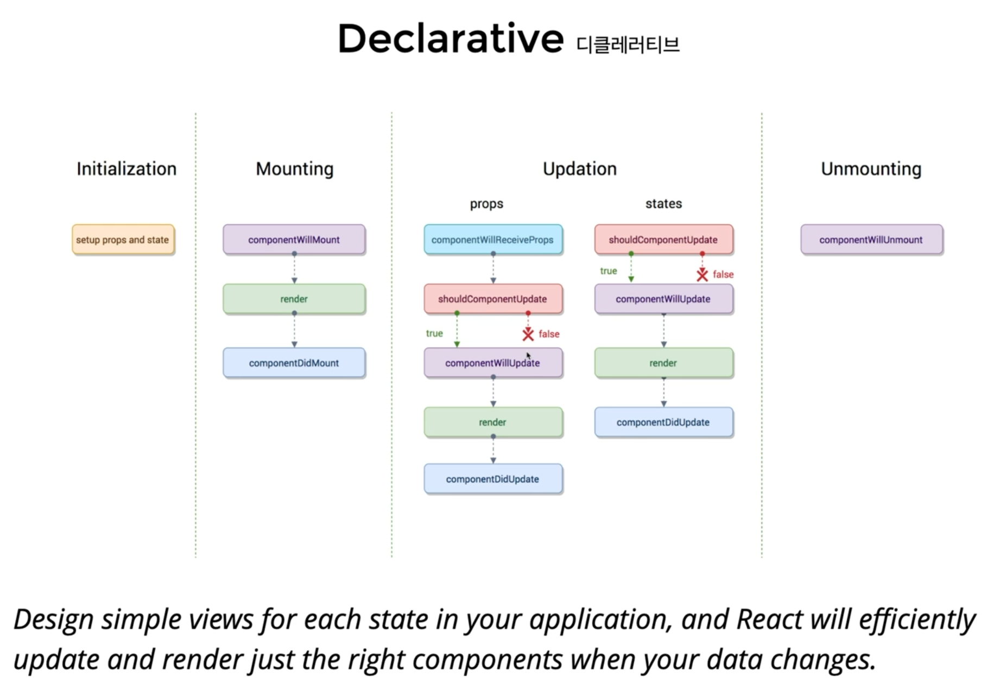

<h1>React Component</h1>

***

1. React.createElement(타입)<br/>
```
    React.createElement(
        type, // 태그 이름 문자열 | 리액트 컴포넌트 | React.Fragment
        [props], // 리액트 컴포넌트에 넣어주는 데이터 객체
        [...children] // 자식으로 넣어주는 요소들
    );
```
<br/>

2. babel<br/>
  우리가 작성한 어떤 코드 => 순수하게 실행할 수 있는 자바스크립트<br/>
  위 문장의 => 부분을 해주는 것이 babel<br/>
  JSX 문법으로 작성된 코드는 순수한 JavaScript로 컴퍼일하여 사용한다.<br/>
  그걸 해주는 것이 babel<br/>
  즉, 원래는 render 함수 내에 createElement를 사용해야하는 것을 직관적인 문법으로 사용할 수 있게 해준다.<br/>

  ```
    ReactDOM.render(
      React.createElement(
        "div",
        null, 
        React.createElement("h1", null, "주제")
      ),
      document.querySelector("#root")
    )
  ```
  <br/>
  위와 같은 형태를 아래와 같은 형태로 사용할 수 있게 해준다<br/><br/>

  ```
    ReactDOM.render(
      <div a="a">
        <h1>주제</h1>
      </div>,
      document.querySelector("#root")
    );
  ```
  <br/>

3. JSX의 형태<br/>
  ```
    ReactDOM.render(
      <div a="a">
        <h1>주제</h1>
      </div>,
      document.querySelector("#root")
    );
  ```
  <br/>
  
  >>위에서 `<div>` 의 children은 `<h1>`<br/>
  >>`<div>`의 a="a" 가 Props(전달 객체)<br/>
  >>그 형태가 {a: "a"}로 `<div>`와 그 자손인 `<h1>`까지 전달된다.<br/>
  
  <br/>

4. 왜 JSX를 사용하는가?<br/>
  React.createElement VS JSX<br/>
  >>>가독성이 JSX의 완승임(위의 사례에서 볼 수 있음)<br/>

  >>babel과 같은 컴파일 과정에서 문법적 오류를 인지하기 쉬움<br/>
  
  <br/>

5. JSX 문법<br/>
  >>최상위 요소가 하나여야 함<br/>
  >>>그래서 간혹 보면 어떤 속성도 없이 <></>같은 Fragment를 사용하곤 한다<br/>

  >>최상위 요소를 리턴하는 경우, ()로 감싸야 함<br/>
  >>자식들을 바로 렌더링하고 싶으면, <>자식들</>를 사용<br/>
  
  >>>=> Fragment<br/>
  >>자바스크립트 표현식을 사용하려면, {표현식}을 이용<br/>
  
  ```
    const title = "주제!!!";
    <h1>{title}</h1>
    => <h1>주제!!!</h1>
  ```
  
  >>if문 사용 불가<br/>
  >>>삼항 연산자 혹은 &&를 사용<br/>

  >>style을 이용해 인라인 스타일링이 가능<br/>
  >>>Props 사용<br/>

  >>class 대신 className을 사용해 class를 적용<br/>

  >>자식요소가 있으면, 꼭 닫아야 하고, 자식요소가 없으면 열면서 닫아야 함<br/>
  >>>`<p>`어쩌구`</p>`<br/>
  >>>`<br />`<br/>

6. Props와 State<br/>
  >>Props : 컴포넌트 외부에서 컴포넌트에게 주는 데이터<br/>
  >>State : 컴포넌트 내부에서 변경할 수 있는 데이터. 항상 객체 형태로 사용해야함<br/>
  >>State 생성_1<br/>
  ```
    state = {
      count: 0,
    };
  ```
  <br/>
  
  State 생성_2(생성자 활용)<br/>

  ```
    constructor(props) {
      super(props);

      this.state = { count: 0 };
    }
  ```

>>둘 다 변경이 발생하면, 렌더가 다시 일어날 수 있음<br/>

  <br/>

7. Render 함수<br/>
  Props와 State를 바탕으로 컴포넌트를 그림<br/>
  Props와 State가 변경되면, 컴포넌트를 다시 그림<br/>
  즉, 컴포넌트를 그리는 방법을 기술하는 함수<br/><br/>

8. state 값 변경_1<br/>
  일반적으로 생각하는 방식으로는 값을 변경할 수 없다.<br/>
  8번에서 선언한 state를 예시로 설명<br/>
  잘못된 값 변경 시도 : this.state.count = this.state.count + 1<br/>
  위와 같이 시도를 해도 this.state.count의 값이 1로 변경되지 않는다.<br/>
  정상적 값 변경 : this.setState(count: this.state.count + 1,);<br/>
  이는 프론트는 변경사항 생길 시 변경사항을 반영하기 위해서 다시 렌더리를 통해 화면을 표준출력장치(모니터)에 다시 그려줘야 하는데<br/>
  React에서는 state 변경 시 setState 함수를 호출하면 state 값 변경 후 render 함수를 다시 호출하는 것<br/>

9. state 값 변경_2<br/>
  1번의 값 변경 방식은 state 객체를 새로 만들어서 값을 할당하는 방식이라면<br/>
  다음은 이전 state 객체를 이용하여 값을 변경하는 방식<br/>
  ```
  this.setState((previousState) => {
    const newState = {count: previousState.count + 1}
    return newState;
  })
  ```
  <br/>

10. Event Handling<br/>
  HTML DOM에 클릭하면 이벤트가 발생하고, 발생하면 그에 맞는 변경이 일어나도록 해야함<br/>
  JSX에 이벤트를 설정할 수 있음<br/>

  - 예시
  ```
  class Comp extends React.Compoinent {
    render() {
      return (
        <div>
          <button onClick={() => {
            console.log('clicked');
          }}>클릭</button>
        </div>
      )
    }
  }
  ```

  위의 예시에서 JSX는 onClick에 해당하는 "() => {console.log('clicked');}"<br/>
  이 부분이 button Element에 Props로 전달된다.<br/>
  그 안에서 버튼이 실제 Element이면 "onClick" 부분을 해석해서 이벤트 이름으로 연결된다면 그 부분을 실제 Element에 <br>
  EventListener로 등록하게 됨<br/>

  - camelCase로만 사용 가능 : <br/>
    * onClick, onMouseEnter<br/>
  - 이벤트에 연결된 자바스크립트 코드는 함수<br/>
    * 이벤트={함수}와 같이 사용<br/>
  - 실제 DOM 요소들에만 사용 가능<br/>
    * 리액트 컴포넌트에 사용하면, 그냥 props로 전달되고 끝<br/>

<br/>

***
<h2>v16.3 이전의 LifeCycle Hook의 내용</h2>

11. Component Lifecycle<br/>
  - 리액트 컴포넌트는 탄생부터 죽음까지 여러지점에서 개발자가 작업이 간편하도록 메서드를 오버라이딩 할 수 있게 해준다.</br>
    Devlarative<br/>


  - v16.3 이전의 LifeCycle Hook의 내용이지만 알아둬야 현재 버전에 대해서도 이해가 편하다
  - React Component Lifecycle은 Declarative라는 성질을 가짐</br>
    - Initialization ~ Mounting : 처음 그려지는 부분
    - Unmounting : 화면에서 사라지는 부분
  - Initialization : Constructor 부분을 의미<br/>
    즉, Constructor(생성자)가 호출되면서 Props가 세팅되고 States의 초기값이 설정되는 것
  - Mounting
    - componentWillMount : render 직전의 단계
    - render : 화면에 그려지는 단계
    - componentDidMount : render 이후의 단계
  - Updation : props나 states가 변경되는 것
    - props나 states가 변경되면 render메서드가 다시 호출된다.
    - props 변경 시
      - componentWillReceiveProps - shouldComponentUpdate - componentWillUpdate - render - componentDidUpdate
    - states 변경 시
      - shouldComponentUpdate - componentWillUpdate - render - componentDidUpdate
    - render 전 후의 Hook들을 Lifecycle들을 지정해서 그것들을 실행할 수 있도록 해줌
    - componentWillReceiveProps, shouldComponentUpdate 등은 모두 HOOK이고 shouldComponentUpdate가 해당 props나 states가</br>
      변경이 되어서 render 함수를 다시 호출해야하는지 판단을 한다.(true/false)
    - shouldComponentUpdate를 사용하는 이유는 불필요하게 render되는 것을 방지 함으로써 React Component 성능 최적화에 도움을 줌<br/><br/>

12. Component 생성 및 마운트(v16.3 이전)(Initialization, Mounting )
  - 생성 : Component가 객체화 되는 구간
  - 마운트 : 브라우저 어딘가에 그려지는 구간
  - constructor : Component가 생성되는 곳
  - componentWillMount : 마운트 되기 직전
  - render(최초 랜더 시점)) : 마운트되는 시점
  - componentDidMount : 마운트 된 직후<br/><br/>

13. Updation
  - componentWillReceiveProps
    - props를 새로 지정했을 때 바로 호출
    - state의 변경에 반응하지 않음
    - props의 값에 따라 state를 변경해야 한다면,
      - setState를 이용해 state 변경
      - 다음 이벤트(shouldComponentUpdate)로 각각 가는 것이 아니라 한번에 변경<br/><br/>

  - shouldComponentUpdate
    - props만 변경되어도
    - state만 변경되어도
    - props & state 둘 다 변경되어도
    - newProps와 newState를 인자로 호출
    - return type이 boolean
      - true면 render 호출
      - false면 render 미호출
      - 이 함수를 구현하지 않으면, default는 true<br/><br/>

  - componentWillUpdate
    - 컴포넌트가 재랜더링 되기 직전에 호출
    - setState 등은 사용 불가<br/><br/>

  - componentDidUpdate
    - 컴포넌트가 재 랜더린을 마치면 호출<br/><br/>

14. Unmount
  - componentWillUnmount
    - 해당 컴포넌트가 사용하고 있던 메모리 중 정리할 것이 있으면 정리
    - API 요청을 이 컴포넌트가 보냈는데 응답을 받기 전 Unmount 된다면 요청 API를 더이상 받을 준비를 하지 않겠다는 작업 처리
      즉, Abort 처리를 여기서 함

<br/>

***
<h2>v16.3 이후의 LifeCycle Hook의 내용</h2>

15. 16.3 이후 Component Lifecycle 변경
  - Initialization
    - constructor : 동일

  - Mounting
    - componentWillMount -> getDerivedStateFromProps
      - 이전에는 componentWillMount 메서드를 상속받으면 됐음
      - 하지만 getDerivedStateFromProps는 Class Component의 static 메서드로 지정해줘야 함
      - parameter : nextProps, prevState
      - return이 있어야 함
      - 의미 : 예전에는 Props를 받아서 State 재정의도 할 수 있었는데 이제는 그것만 하는 HOOK으로 변경된 것<br/>
        새로운 Props가 들어오면 State를 리턴해줄 수 있는 것
      - 시간의 흐름에 따라 변하는 props에 state가 의존하는 경우에만 사용되어서 특별한 경우에만 사용
        ```
        static getDerivedStateFromProps(nextProps, prevState) {
          console.log("getDerivedStateFromProps", nextProps, prevState);

          return {
            age: 390,
          };
        }

        ``` 
    - render : 동일
    - componentDidMount : 동일

  - Updation : props나 states가 변경되는 것
    - componentWillReceiveProps -> getDerivedStateFromProps
    - shouldComponentUpdate : 동일
    - render : 동일
    - componentWillUpdate -> getSnapshotBeforeUpdate
      - (render 메서드가 호출되고 실제 dom에 적용되기 직전에 호출)
      - Update 되기 전 어딘가에 Snapshot을 어딘가에 저장 한다는 것
      - Snapshot : getSnapshotBeforeUpdate의 return
      ```
      getSnapshotBeforeUpdate(prevProps, prevState) {
        if (prevState.list.length === this.state.list.length) return null;
        const list = document.querySelector("#list");
        return list.scrollHeight - list.scrollTop;
      }
      ```
    - componentDidUpdate : 동일
      - getSnapshotBeforeUpdate에서 구해진 snapshot을 확인할 수 있음
      ```
      componentDidUpdate(prevProps, prevState, snapshot) {
        console.log(snapshot);
        if (snapshot === null) return;
        const list = document.querySelector("#list");
        list.scrollTop = list.scrollHeight - snapshot;
      }
      ```
      - 위 코드의 parameter 중 snapshot이 getSnapshotBeforeUpdate의 return

  - UnMounting
    - componentWillUnmount : 동일

16. Component 에러 캐치
  - componentDidCatch<br/><br/>