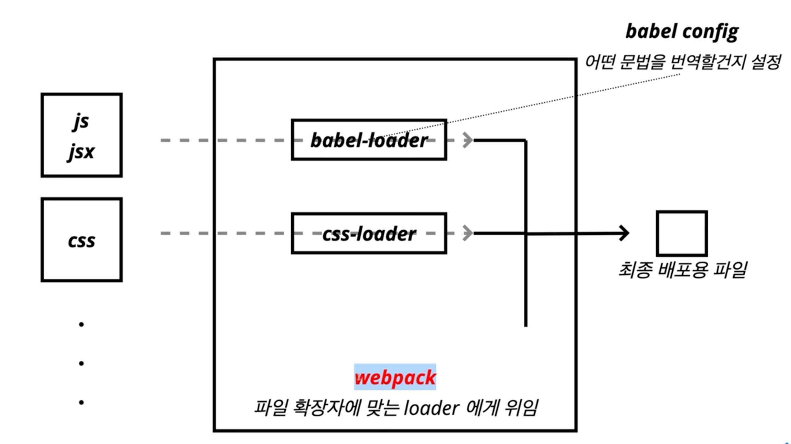

<h1>Creating React Project</h1>

1. Create React App
  - https://create-react-app.dev
    - Facebook 오픈소스
    - React 개발에 필요한 것들을 지원해줌
  
  - CRA로 react 프로젝트 만들기 : npx create-react-app tic-tac-toe
    - npx 명령어 : npm5.2.0 이상부터 함께 설치된 커맨드라인 명령어
    - 최신 라이브러리인지 확인해서 아니면 최신 라이브러리로 업데이트 후 프로젝트 생성해주는 명령어
    
  - 아래 메세지 발생함
    ```
    You are running `create-react-app` 4.0.3, which is behind the latest release (5.0.1).

    We no longer support global installation of Create React App.

    Please remove any global installs with one of the following commands:
    - npm uninstall -g create-react-app
    - yarn global remove create-react-app

    The latest instructions for creating a new app can be found here:
    https://create-react-app.dev/docs/getting-started/

    ```
  - 메세지에서 제시하는 명령어 입력해도 안됨
    - npm uninstall -g create-react-app 
    - yarn global remove create-react-app
  - 내 경우 설치되어있는 npm 버전이 7.10.0이고 node 버전이 v16.0.0 인데도 저 오류가 발생함
  - 해결 : create-react-app 뒤에 @latest를 붙여야 함
    - npx create-react-app@latest tic-tac-toe 

2. create-react-app
  - create-react-app으로 만든 프로젝트는 node.js 기반의 프로젝트임
  - node 프로젝트이므로 package.json 파일 존재
  - package.json
    ```
    {
      "name": "tic-tac-toe",
      "version": "0.1.0",
      "private": true,
      "dependencies": {
        "@testing-library/jest-dom": "^5.16.4",
        "@testing-library/react": "^13.1.1",
        "@testing-library/user-event": "^13.5.0",
        "react": "^18.1.0",
        "react-dom": "^18.1.0",
        "react-scripts": "5.0.1",
        "web-vitals": "^2.1.4"
      },
      "scripts": {
        "start": "react-scripts start",
        "build": "react-scripts build",
        "test": "react-scripts test",
        "eject": "react-scripts eject"
      },
      "eslintConfig": {
        "extends": [
          "react-app",
          "react-app/jest"
        ]
      },
      "browserslist": {
        "production": [
          ">0.2%",
          "not dead",
          "not op_mini all"
        ],
        "development": [
          "last 1 chrome version",
          "last 1 firefox version",
          "last 1 safari version"
        ]
      }
    }

    ```

3. 주요 라이브러리
  - dependencies

  ```
  "dependencies": {
    "@testing-library/jest-dom": "^5.16.4",
    "@testing-library/react": "^13.1.1",
    "@testing-library/user-event": "^13.5.0",
    "react": "^18.1.0",
    "react-dom": "^18.1.0",
    "react-scripts": "5.0.1",
    "web-vitals": "^2.1.4"
  },
  ```

  - 기본 라이브러리
    - "react": "^18.1.0",
    - "react-dom": "^18.1.0",
    - "react-scripts": "5.0.1",
      - 프로젝트가 개발환경으로 실행하거나, 프로덕션 모드에서 배포를 위한 빌드작업을 하는 create-react-app의 관리역할 라이브러리
      - 명기된 버전(5.0.1)이 create-react-app의 버전과 동일

  - 테스팅 라이브러리 : @testing-library
    - "@testing-library/jest-dom": "^5.16.4",
    - "@testing-library/react": "^13.1.1",
    - "@testing-library/user-event": "^13.5.0",
  
  - "web-vitals": "^2.1.4"
    - 구글에서 사이트 경험을 측정하고 개선할 수 있도록 정보를 얻어내는 라이브러리

  <br/>

  - scripts

  ```
  "scripts": {
    "start": "react-scripts start",
    "build": "react-scripts build",
    "test": "react-scripts test",
    "eject": "react-scripts eject"
  },
  ```

  - create-react-app에서 사용 가능한 명령어
    - start : npm start
    - build : npm run build
    - test : npm run test
    - eject : npm run eject
  - 각 명령어는 dependencies의 react-scripts의 start, build, test, eject를 실행함
  - npm start
    - react-scripts start 실행
    - Development server 실행
    - 소스코드 수정 시 재 컴파일 후 브라우저 새로고침하며 반영됨
  - npm run build
    - react-scripts build 실행
    - optimized production build 생성
    - build 폴더에 생성되므로 그 폴더를 파일서버로 띄우면 프로덕션용 리액트 App 서버가 실행됨
    - production 실행 명령어
    
      ```
      npm install -g serve
      ※ 맥에서 권한 부족 메세지 발생 시
        sudo npm install -g serve 입력 후 Mac 비번 입력
      serve -s build
      ```
    - serve 패키지 전역 설치
    - serve 명령어를 -s 옵션으로 build 폴더를 지정하여 실행
      - -s 옵션은 어떤 라우팅으로 요청해도 index.html을 응답하도록 함
    
  - npm test
    - react-scripts test 실행
    - Jest를 통해 test code를 실행
    - 아래 파일을 찾아서 실행함
      - __tests__ 폴더 안의 .js 파일
      - .test.js로 끝나는 파일
      - .spec.js로 끝나는 파일
    - npm run eject
      - react-scripts eject
      - react-scripts를 사용하지 않겠다는 뜻으로 create-react-app 안의 프로젝트를 CRN과 관계없이 설정 변경 가능


<center>빌드 파일구조</center>


<br/><br/>

<center>webpack</center>




  
