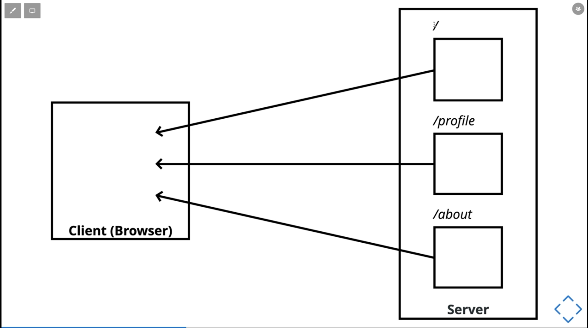
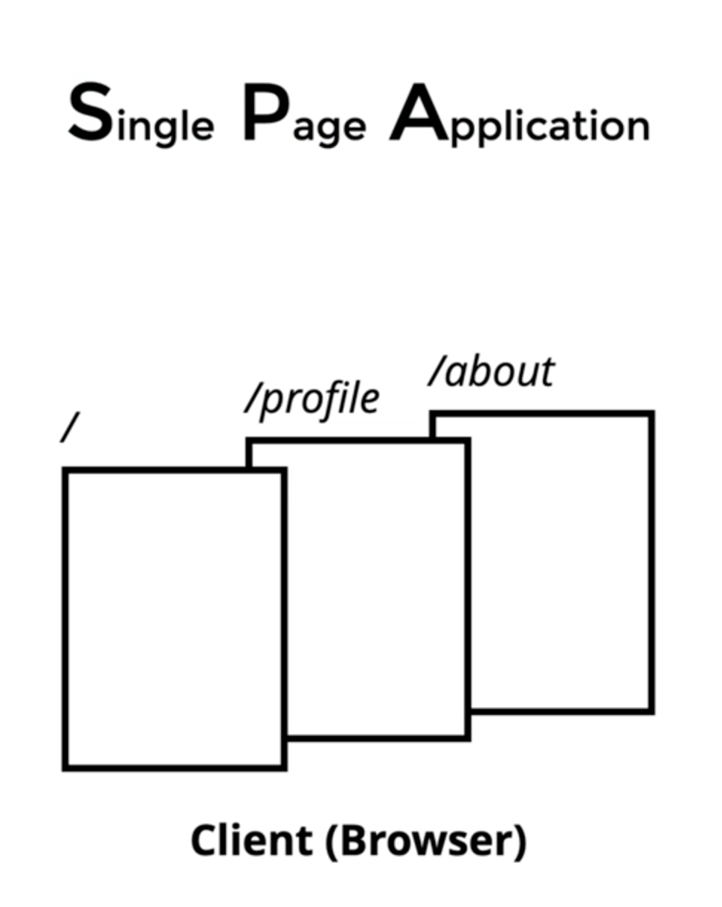
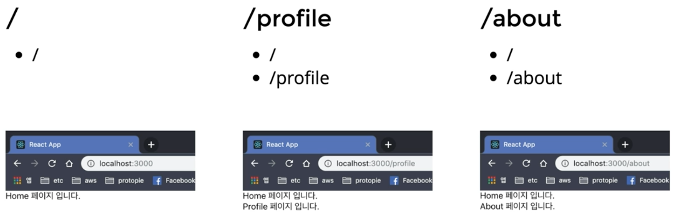
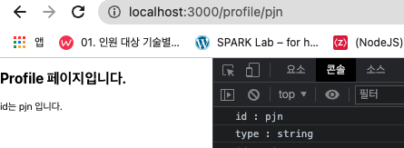
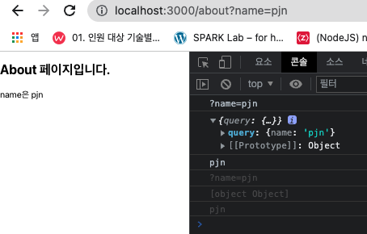
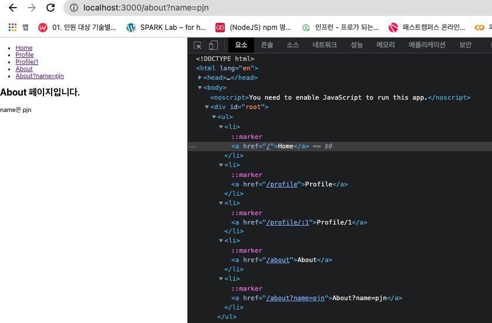
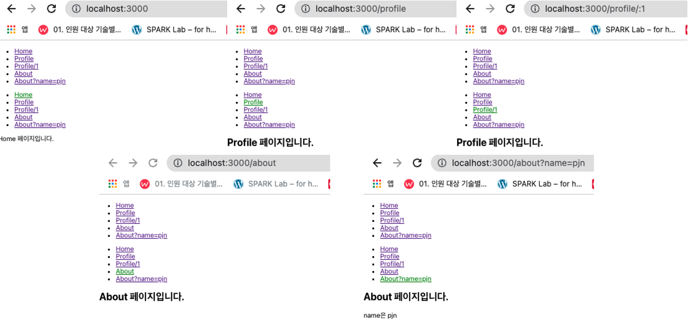
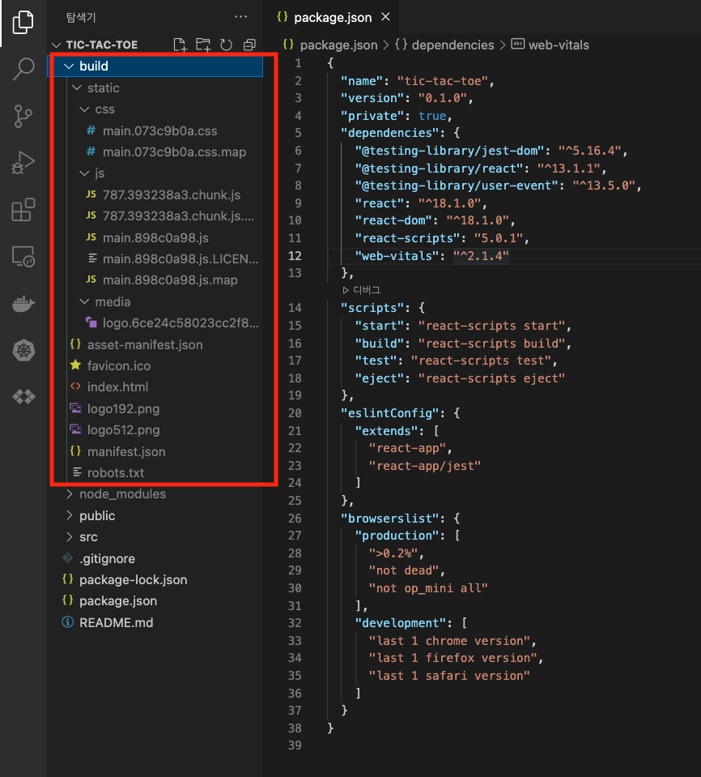

<h1>React Router</h1>

1. Create React App
<center>전통적 방식의 CS Web</center>



<center>* url이 변경될때마다 서버에서 데이터 요청</center>
<br/>

<center>리액트 이후 Web</center>



<center>* 하나의 큰 앱을 받아온 후 클라이언트 단에서 변경요청을 처리하는 방식</center> <br/>

- SPA 라우팅 과정

  1. 브라우저에서 최초에 '/' 경로로 요청을 하면
  2. React Web App을 내려줌
  3. 내려받은 React App에서 '/' 경로에 맞는 컴포넌트를 보여줌
  4. React App에서 다른 페이지로 이동하는 동작을 수행하면,
  5. 새로운 경로에 맞는 컴포넌트를 보여줌

<br/>

- React는 컴포넌트의 생성 및 render만 할 뿐,<br/>
  브라우저의 요청(url의 변경)에 따라 어떤 컴포넌트를 보여줄지는 라우팅의 역할

<br/>

- React의 범주를 넘어서는 것이므로 별도의 react router를 설치해야 함

  - 명령어 : npm i react-router-dom

    - cra 기본 내장 패키지 아님
    - react-router-dom은 Facebook의 공식 패키지 아님
    - 가장 대표적인 라우팅 패키지

  - 설치
    - 프로젝트 생성
      ```
      > npx create-react-app@latest react-router-example
      ```
    - react-router-dom 설치
      ```
      > cd react-router-example
      > npm i react-router-dom
      ```
  - 특정 경로에서 보여줄 컴포넌트 준비
    - '/' : Home 컴포넌트
    - '/profile' : Profile 컴포넌트
    - '/about' : About 컴포넌트
    - /src 하위에 pages 폴더 생성 후 Home.jsx, Profile.jsx, About.jsx 생성
  - App.js 작성 시 주의사항

    - 강의 시점과 라우터 버전이 달라져(V5 -> V6) 사용 문법도 변경이 있음<br/>
    - react-router-dom docs : https://reactrouter.com/docs/en/v6/api
    - 참고1 : https://abangpa1ace.tistory.com/209
    - 참고2 : https://www.youtube.com/watch?v=CHHXeHVK-8U
    - 참고3 : https://kyung-a.tistory.com/36
    - 그 외에도 많은 유튜브 강의나 페이지들이 있음

    <center>21.11 이전</center>

          ```
          <App.js >

          <BrowserRouter>
              <Route path="/" component={Home} />
              <Route path="/profile" component={Profile} />
              <Route path="/about" component={About} />
          </BrowserRouter>
          ```

    <center>21.11 이후</center>

          ```
          App.js

          <BrowserRouter>
            <Routes>
              <Route path="/" element={<Home />} />
              <Route path="/profile" element={<Profile />} />
              <Route path="/about" element={<About />} />
            </Routes>
          </BrowserRouter>
          ```

    - 변경된 이유는 이전 버전의 경우, "/profile"과 "/about"은 Home의 path인 "/"와 중첩되므로<br/>
      이전 버전의 경우 "/profile" 또는 "/about"으로 조회할 경우, 아래와 같이 Home페이지와 중첩 조회된다.<br/>
      그래서 이전 버전의 경우 Home 페이지의 component props에 exact 명기를 해줬는데<br/>
      현재 버전은 <Routes>의 모든 child인 <Route>의 요소를 살펴보고 가장 일치하는 항목을 찾아 UI의 해당 분기를 렌더링하며<br/>
      exact 옵션 삭제됨
    - Switch -> Routes 변경사항 상세
      - `<Route>` 요소들을 포함하는 `<Routes>`로 Wrapper 명칭 변경
      - `<Route>`는 component 및 render에 화살표 함수를 사용하지 않고, element 속성에 JSX 컴포넌트를 전달해줌
      - exact 옵션 삭제. 기본적으로 exact가 적용되며, 모든 하위 path에서 라우팅을 하고 싶다면 path 끝에 `*` 붙임
      - path에 ":id"와 같은 하위경로, "." 및 ".." 와 같은 상대경로도 지정이 가능

<br/>

<center>react-routerPrev</center>



<br/><br/>

2. Dynamic 라우팅

- 위의 경우 fixed path이므로 url을 동적으로 처리해서 값을 받아와 element에서 보여준다던지 또는 그 값을 이용해 어떤 로직을 처리해야 할 수 있다.
- id를 이용한 Element 처리

  - id를 이용한 동적 라우팅 시에는 App.jsx에 /profile/:id와 같이 id를 받아서 처리할 Route 작업을 별도로 해줘야 함.
  - name을 이용할 시에는 App.jsx에 별도 Route 처리 불필요

  ```
  App.jsx

  <Route path="/profile" element={<Profile />} />
  <Route path="/profile/:id" element={<Profile />} />

  Profile.jsx

  import { useParams } from 'react-router-dom';
  export default function Profile(props) {
    const id = useParams().id;
    console.log(id);
    console.log(id, typeof id);

    return (
      <div>
        <h2>Profile 페이지입니다.</h2>
        {id && <p>id는 {id} 입니다.</p>}
      </div>
    );

  }
  ```

<center>결과(ID)</center>



<br/>

- name을 이용한 Element 처리

  ```
  About.jsx

  import { useLocation } from 'react-router-dom';
  import queryString from 'query-string';

  export default function About(props) {
    const searchParams = useLocation().search;
    console.log(searchParams);

    // URLSearchParams을 이용한 name 출력
    // const obj = new URLSearchParams(searchParams);
    // console.log(obj.get('name'));

    // queryString을 이용한 name 출력
    const query = queryString.parse(searchParams);
    console.log({ query });
    console.log(query.name);

    const name = query.name;

    return (
      <div>
        <h2>About 페이지입니다.</h2>
        {name && <p>name은 {name}</p>}
      </div>
    );
  }

  ```

<center>결과(NAME)</center>



- 브라우저 내장 객체인 URLSearchPrams의 생성자를 이용하여 "?name=pjn"를 가져올 수 있지만, 그 경우 두가지 단점 존재

  - URLSearchParams의 메서드를 기억해야함. obj의 property 이름으로 꺼내쓸 수 없음.<br/>
    ex. obj.get("name")
  - 브라우저별로 지원하지 않는 것들이 있을 수 있음<br/>
    ex. InternetExploer

- property로 바로 꺼내 쓸 수 있는 라이브러리 사용이 효율적
  - query-string
  ```
  > npm i query-string
  ```
  <br/><br/>

3. Switch와 notFound

- Switch(V5) -> Routes(V6) 변경사항 상세
  - `<Route>` 요소들을 포함하는 `<Routes>`로 Wrapper 명칭 변경
  - `<Route>`는 component 및 render에 화살표 함수를 사용하지 않고, element 속성에 JSX 컴포넌트를 전달해줌
  - exact 옵션 삭제. 기본적으로 exact가 적용되며, 모든 하위 path에서 라우팅을 하고 싶다면 path 끝에 `*` 붙임
  - path에 ":id"와 같은 하위경로, "." 및 ".." 와 같은 상대경로도 지정이 가능
- NotFound 페이지 예시

```
App.jsx

import { BrowserRouter, Route, Routes } from 'react-router-dom';
import About from './pages/About';
import Home from './pages/Home';
import NotFound from './pages/NotFound';
import Profile from './pages/Profile';

function App() {
	return (
		<BrowserRouter>
			<Routes>
				<Route path="/" element={<Home />} />
				<Route path="/profile" element={<Profile />} />
				<Route path="/profile/:id" element={<Profile />} />
				<Route path="/about" element={<About />} />
				<Route path="/*" element={<NotFound />} />
			</Routes>
		</BrowserRouter>
	);
}

export default App;

NotFound.jsx

export default function NotFound() {
	return <div>페이지를 찾을 수 없습니다.</div>;
}
```

- 지정하지 않은 경로에서 default로 출력되는 페이지를 생성하고 싶을 시<br/>
  `<Route path="/*" element={<NotFound />} />`<br/>
  처럼 Route 처리 후 NotFound 페이지를 생성해준다.
  <br/><br/>

4. JSX 링크로 라우팅 이동하기

- `<a href="">` 태그를 이용하여 이동을 하게 되면 전통적 방식처럼 서버에서 리턴받아오기 때문에 React 사상과 맞지 않음
- react-router-dom 라이브러리의 Link 컴포넌트 이용하는 방식을 사용해야함

  - import { BrowserRouter, Link, Route, Routes } from 'react-router-dom';
  - `<Link to="/">Home</Link>`
  - `<a>`태그와 달리 `<Link>` 태그를 이용할 시 이동 시에 서버에서 리턴 받지 않는다.
  - Link는 /src/App.jsx가 아니라 /src/components 하위에 Links.jsx에 만든다.
  - Link 태그를 이용해서 처리를 하는 것도 내부적으로는 `<a>`태그를 이용

  ```
  App.jsx

  <BrowserRouter>
  <Links />
  <Routes>

  /src/components/Links.jsx

  import { Link } from 'react-router-dom';

  export default function Links() {
    return (
      <ul>
        <li>
          <Link to="/">Home</Link>
        </li>
        <li>
          <Link to="/profile">Profile</Link>
        </li>
        <li>
          <Link to="/profile/:1">Profile/1</Link>
        </li>
        <li>
          <Link to="/about">About</Link>
        </li>
        <li>
          <Link to="/about?name=pjn">About?name=pjn</Link>
        </li>
      </ul>
    );
  }

  ```

<center>Link 결과 화면</center>



<br/>

- NavLink(네비게이션 링크)

  - 링크가 활성화 되었을때 활성화 NavLink만 스타일을 입힐 수 있음
  - import { NavLink } from 'react-router-dom';
  - activeClassName, activeStyle처럼 active 상태에 대한 스타일 지정 가능하지만 V6에서 사라지고 아래와 같은 형태로 사용해야 함
    ```
    <NavLink
      style={({ isActive }) => ({ color: isActive ? 'green' : '' })}
      className={({ isActive }) => "nav-link" + (isActive ? 'activated' : '' )}
    </NavLink>
    ```
  - Route의 path처럼 동작하므로 end(V6)로 특정 path 일치 여부 체크 존재
  - 중첩 path의 하위 path별 activeStyle 처리는 다음과 같이 처리(참고)

    ```
    /src/components/NavLinks.jsx

    import { NavLink, useLocation } from 'react-router-dom';
    import queryString from 'query-string';

    export default function NavLinks() {
      const searchParams = useLocation().search;
      const path = useLocation().pathname;
      const search = queryString.parse(searchParams);
      const nameChk = () => (search.name === 'pjn' ? true : false);
      const pathAboutChk = () => (path === '/about' ? true : false);
      const activeStyle = ({ isActive }) => ({ color: isActive ? 'green' : '' });

      return (
        <ul>
          <li>
            <NavLink end to="/" style={activeStyle}>
              Home
            </NavLink>
          </li>
          <li>
            <NavLink end to="/profile" style={activeStyle}>
              Profile
            </NavLink>
          </li>
          <li>
            <NavLink to="/profile/:1" style={activeStyle}>
              Profile/1
            </NavLink>
          </li>
          <li>
            <NavLink end to="/about" style={pathAboutChk() && !nameChk() ? { color: 'green' } : { color: '' }}>
              About
            </NavLink>
          </li>
          <li>
            <NavLink end to="/about?name=pjn" style={pathAboutChk() && nameChk() ? { color: 'green' } : { color: '' }}>
              About?name=pjn
            </NavLink>
          </li>
        </ul>
      );
    }
    ```

<center>결과</center>



<br/><br/>

5. JS로 라우팅 이동하기

- V5는 props 인풋을 받아서 props.history 객체의 내장 함수 push, go, goback 등을 이용해서 페이지 이동을 시킴
- V6는 history 객체는 사라지고 useNavigate()를 이용해서 처리함

  - App.js

  ```
  import Login from './pages/Login';

  function App() {
    return (
      <BrowserRouter>
        <Routes>
          <Route path="/login" element={<Login />} />
  ```

  - /src/pages/Login.jsx

  ```
  import LoginButton from '../components/LoginButton';

  export default function Login() {
    return (
      <div>
        <h2>Login 페이지 입니다.</h2>
        <LoginButton />
      </div>
    );
  }
  ```

  - /src/components/LoginButton.jsx

  ```
  import { useNavigate } from 'react-router-dom';

  export default function LoginButton() {
    const navigate = useNavigate();

    function login() {
      setTimeout(() => {
        navigate('/');
      }, 1000);
    }

    return <button onClick={login}>로그인하기</button>;
  }
  ```

- V5는 Login.jsx에서 LoginButton에 props 인자를 던지고 LoginButton에서 전달받은 propt.history.puth("/") 처리하거나 react-router-dom의 withRouter 함수를 이용하여 Login.jsx에서 props를 전달받지 않고 LoginButton에서 자체처리
- V6는 withRouter(), history가 삭제되어 props를 전달받을 필요 없음
  - LoginButton.jsx에서 useNavigate()를 이용하여 처리

<br/><br/>

6. Redirect
- V6에서는 위에서 살펴본 withRouter와 함께 Redirect 컴포넌트도 사라짐
- 마찬가지로 useNavigate()를 이용하여 처리하면 됨

<br/><br/>

<center>빌드 파일구조</center>



```

```

```

```
