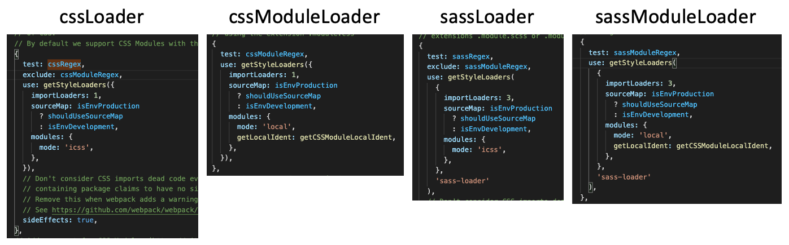
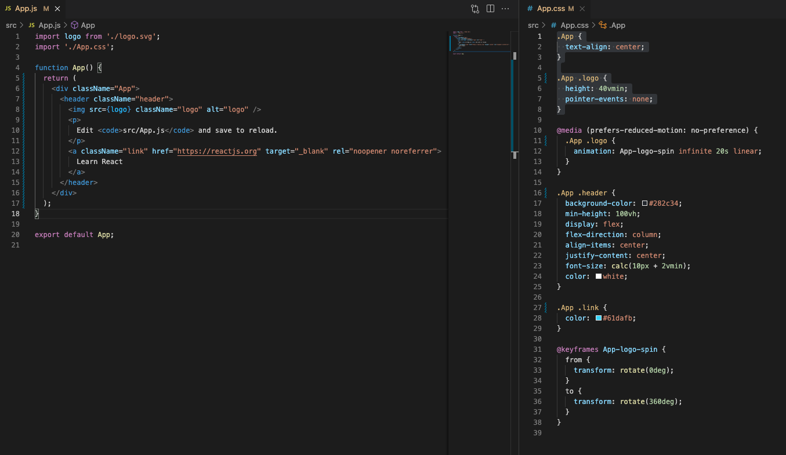
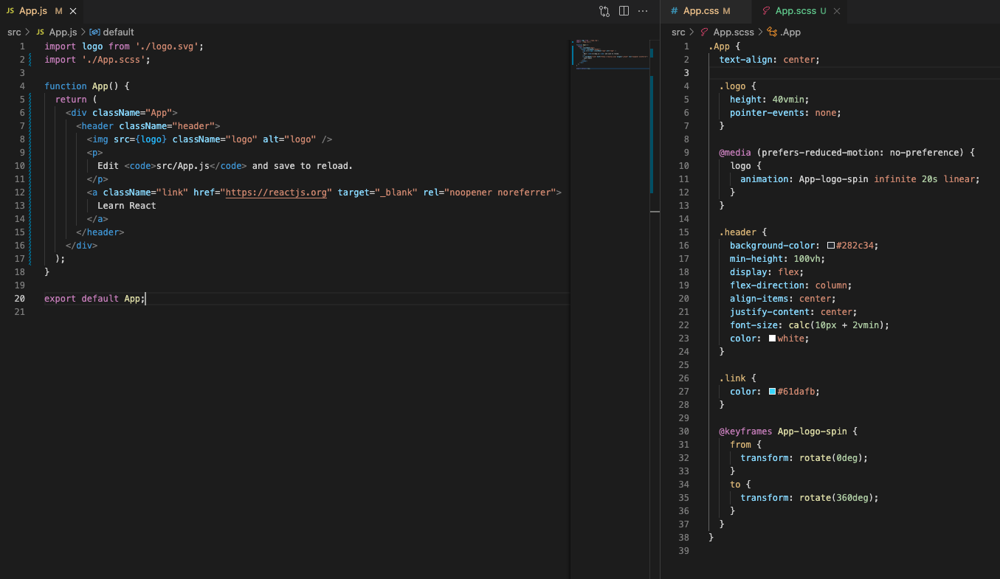
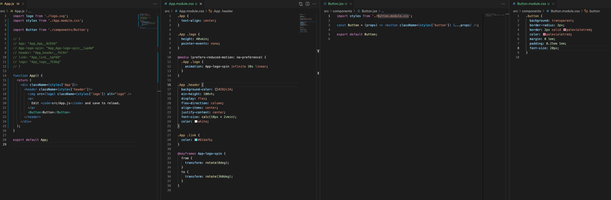
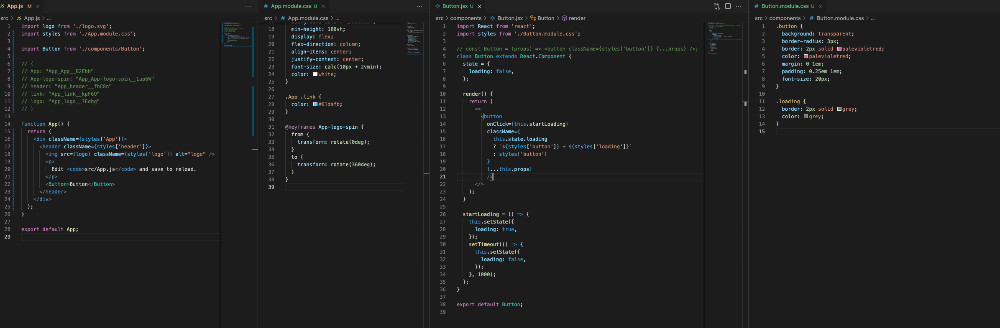
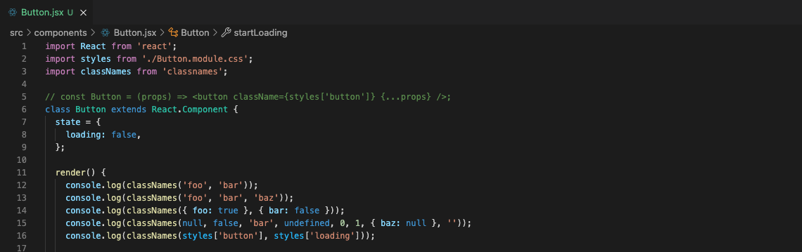
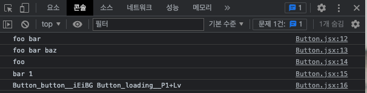
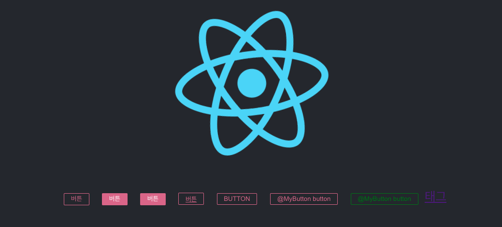

<h1>React Component Styling</h1>

1. Style Loaders

- .js, .jsx import 시 webpack의 babel-loader에게 위임된 후 babel config를 통해 적용 됨
- .css등 다른 확장자는 style-loader, css-loader 등 확장자에 맞는 loader에 위임된 후 적용됨
- 프로젝트 생성
  ```
  > npx create-react-app@latest style-loaders-example
  > cd style-loaders-example
  > code .
  > npm run eject
    => npm 프로젝트에서 라이브러리들 꺼내기
  ```
- style 관련 Loader는 총 4개 존재

  ```
  /config/webpack.config.js

  // style files regexes
  const cssRegex = /\.css$/;
  const cssModuleRegex = /\.module\.css$/;
  const sassRegex = /\.(scss|sass)$/;
  const sassModuleRegex = /\.module\.(scss|sass)$/;
  ```

  <center>webpack style loader</center>



<br/><br/>

2. CSS, SASS

- React 프로젝트 생성 후 App.js 파일을 띄워보면 import된 import './App.css'; 전에 index.css style이 적용된 것들 볼 수 있음
- 리액트의 경우 import 순서에 따라 특정 컴포넌트에 종속되지 않고 전역적으로 추가됨
- 이는 리액트가 컴포넌트의 특성인 문서구조, 스타일, 동작 중 스타일이 특정 컴포넌트에 귀속되지 않는다는 뜻
  - 즉, 리액트는 컴포넌트별 독립적으로 style을 적용할 수 있는 scoping이 제공되지 않는다는 뜻
- .css 파일을 추가할 시, classname이 전역적으로 오염되지 않도록 주의하여야 함
- CSS 방식과 SASS 방식

  - CSS

    - 확장자 : .css

    ```
    .App {
      text-align: center;
    }

    .App .logo {
      height: 40vmin;
      pointer-events: none;
    }

    ```

  <center>css 적용 App.js</center>



- SASS

  - 확장자 : .scss

  ```
  .App {
    text-align: center;

    .logo {
      height: 40vmin;
      pointer-events: none;
    }
  }
  ```

  - .scss 확장자를 css로 적용시키지 위해서는 scss 라이브러리 설치 필요
    ```
    > npm i scss
    ```

  <center>scss 적용 App.js</center>



- BEM : Block Element Modifier
  - class naming 하는 방법론
  - 팀 내의 규칙을 정의하는 방법론

<br/><br/>

3. CSS module, SASS module

- .css 또는 .scss에 프로그래밍 적인 요소를 적용시키고 싶을 시 사용
- CSS module

  - 명명규칙 : `[filename]_[classname]_[hashValue]`
  - 사용법 : `<div className="App">` 같은 방식이 아닌, <br/>
    `<div className={styles['App']}>`와 같이 styles를 이용해 가져와서 사용

  <center>cssModule 적용 App.js</center>



- 여러 클래스명을 중첩해서 사용하기
  <center>cssModule 적용2 App.js</center>



- 많이 복잡하므로 좀 더 쉽게 사용할 수 있도록 해주는 라이브러리 설치

  ```
  > npm i classnames
  ```

  - 사용 예시

  <center>classnamesConsole print 소스</center>

  

<br/>

  <center>classnamesConsolePrint 결과</center>



- classnames/bind를 이용한 render() return 리팩토링
  - classnames 하위 bind를 이용하면 좀 더 쉽게 classnames를 이용하여 className을 적용시킬 수 있음

```
/src/components/Button.jsx

import classNames from 'classnames/bind';

const cx = classNames.bind(styles);
console.log(cx('button', 'loading'));
// 결과 : Button_button__iEiBG Button_loading__P1+Lv

class Button extends React.Component {
  state = {
    loading: false,
  };

  render() {

    const { loading } = this.state;
    return <button onClick={this.startLoading} className={cx('button', { loading })} {...this.props} />;
  }
```

<br/><br/>

4. Styled-components

- 별도의 라이브러리를 이용한 style 처리
- 프로젝트 생성 및 styled-components 라이브러리 설치

  ```
  > npx create-react-app@latest styled-components-example
  > cd styled-component-example
  > npm i styled-components
  > code .
  ```

- 적용 예

  ```
  /src/App.js

  import logo from './logo.svg';
  import './App.css';
  import StyledButton from './components/StyledButton';

  function App() {
    return (
      <div className="App">
        <header className="App-header">
          
          <p>
            <StyledButton>버튼</StyledButton>
            {/* 자동으로 className 부여됨(sc로 시작) */}
          </p>
        </header>
      </div>
    );
  }

  export default App;

  ```

  ```
  /src/components/StyleButton.jsx

  import styled from 'styled-components';

  const StyledButton = styled.button`
    background: transparent;
    border-radius: 3px;
    border: 2px solid palevioletred;
    color: palevioletred;
    margin: 0 1em;
    padding: 0.25em 1em;
    font-size: 20px;
  `;

  export default StyledButton;

  ```

- styled.button`;에서 `에 style을 적용시키는데 text이므로 조심해야 한다.

- 단점 : 전역으로 사용하려고 하면 조금 어려울 수 있음

  - global style 별도 생성하여 전역 style 적용

- 최종 소스 및 결과

  - App.js

  ```
  import logo from './logo.svg';
  import './App.css';
  import StyledButton from './components/StyledButton';
  import styled from 'styled-components';
  import { createGlobalStyle } from 'styled-components';
  import StyledA from './components/StyledA';

  const PrimaryStyledButton = styled(StyledButton)`
    background: palevioletred;
    color: white;
  `;

  const UppercaseButton = (props) => <button {...props} children={props.children.toUpperCase()} />;

  // const MyButton = (props) => <button {...props} children={`MyButton ${props.children}`} />;   // {...props}가 className을 전달해주고 있는 것
  const MyButton = (props) => <button className={props.className} children={`MyButton ${props.children}`} />;

  const StyledMyButton = styled(MyButton)`
    background: transparent;
    border-radius: 3px;
    // border: 2px solid palevioletred;
    border: 2px solid ${(props) => props.color || 'palevioletred'};
    // color: palevioletred;
    color: ${(props) => props.color || 'palevioletred'};
    margin: 0 1em;
    padding: 0.25em 1em;
    font-size: 20px;

    :hover {
      border: 2px solid red;
    }

    ::before {
      content: '@';
    }
  `;

  // 우선순위 밀려서 적용은 안됨
  const GlobalStyle = createGlobalStyle`
    button {
      color: yellow;
    }
  `;

  function App() {
    return (
      <div className="App">
        <GlobalStyle />
        <header className="App-header">
          
          <p>
            <StyledButton>버튼</StyledButton>
            <StyledButton primary>버튼</StyledButton>
            <PrimaryStyledButton>버튼</PrimaryStyledButton>
            <StyledButton as="a" href="/">
              버튼
              {/* 실제로는 a태그임 */}
            </StyledButton>
            <StyledButton as={UppercaseButton}>button</StyledButton>
            <StyledMyButton>button</StyledMyButton>
            <StyledMyButton color="green">button</StyledMyButton>
            <StyledA href="https://google.com">태그</StyledA>
          </p>
        </header>
      </div>
    );
  }

  export default App;

  ```

  - /components/StyleButton.jsx

  ```
  import styled from 'styled-components';
  import { css } from 'styled-components';

  const StyledButton = styled.button`
    background: transparent;
    border-radius: 3px;
    border: 2px solid palevioletred;
    color: palevioletred;
    margin: 0 1em;
    padding: 0.25em 1em;
    font-size: 20px;

    ${(props) =>
      props.primary &&
      css`
        background: palevioletred;
        color: white;
      `}
  `;

  export default StyledButton;

  ```

  - StyledA.jsx

  ```
  import styled from 'styled-components';

  const StyledA = styled.a.attrs((props) => ({
    target: '_BLANK',
  }))`
    color: ${(props) => props.color};
  `;

  export default StyledA;

  ```

  - 결과

    <center>StyledButtonList</center>

  

<br/>

- 좌측부터 아래의 태그 결과임
  - `<StyledButton>버튼</StyledButton>`
  - `<StyledButton primary>버튼</StyledButton>`
  - `<PrimaryStyledButton>버튼</PrimaryStyledButton>`
  - `<StyledButton as="a" href="/">버튼(실제로는 a태그)</StyledButton>`
  - `<StyledButton as={UppercaseButton}>button</StyledButton>`
  - `<StyledMyButton>button</StyledMyButton>`
  - `<StyledMyButton color="green">button</StyledMyButton>`
  - `<StyledA href="https://google.com">태그</StyledA>`
    <br/><br/>
