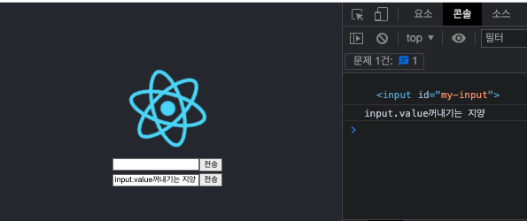

<h1>Ch6. 리액트 실전 활용법</h1>

1. High Order Component(HOC : 고착 컴포넌트)

- HOOK의 등장으로 사용률이 떨어지고 있음
- 리액트 컴포넌트의 로직을 재활용할 수 있는 기술
- 리액트에서만 사용하는 것이 아닌 일종의 pattern
- HOC = function(컴포넌트) { return 새로운 컴포넌트}
  - 컴포넌트 : props를 인자로 받아 UI를 리턴
  - HOC : <컴포넌트>를 인자로 받아 <새로운 컴포넌트>를 리턴
  - React Redux의 connect(), Fragment Container의 createFragmentContainer()도 일종의 HOC
  - react-router-dom V6에서 삭제된 withRouter도 HOC

<br/>

<center>컴포넌트와 HOC</center>


<br/><br/>

2. Controlled Component와 Uncontrolled Component

- 상태를 가지고 있는 엘리먼트
  - input
  - select
  - textarea 등
- 엘리먼트의 '상태' 관리 주체

  - Controlled : 엘리먼트를 가지고 있는 컴포넌트가 관리
  - Uncontrolled : 엘리먼트의 상태를 관리하지 않고, 엘리먼트의 참조만 컴포넌트가 소유

- ControlledComponent

  - class Component에 input 태그와 button 태그 생성
  - input 태그의 onchage 속성에 의해 change() 호출을 통한 state의 value 속성 값 변경
  - button 클릭 시 click() 호출에 의해 출력

  ```
  /src/components/ComtrolledComponent.jsx

  import React from 'react';

  class ControlledComponent extends React.Component {
    state = {
      value: '',
    };

    render() {
      const { value } = this.state;
      return (
        <div>
          <input value={value} onChange={this.change} />
          <button onClick={this.click}>전송</button>
        </div>
      );
    }

    change = (e) => {
      console.log(e.target.value);

      this.setState({ value: e.target.value });
    };

    click = () => {
      console.log(this.state.value);
    };
  }

  export default ControlledComponent;

  ```

  ```
  /App.js

  import logo from './logo.svg';
  import './App.css';
  import ControlledComponent from './components/ControlledComponent';

  function App() {
    return (
      <div className="App">
        <header className="App-header">
          
          <ControlledComponent />
        </header>
      </div>
    );
  }

  export default App;

  ```

<center>Controlled Component 결과</center>


<br/>

- UncontrolledComponent

  - 레퍼런스라는 API 사용
  - click() 통해서 input 엘리먼트의 현재 상태 값(value)를 꺼내서 전송
  - input.value와 같이 엘리먼트의 value값을 직접 꺼내는 방식은 지양
    - 엘리먼트는 리얼돔이므로 dom의 value 값을 꺼낼 수는 있음
    - 리액트는 버츄얼 돔을 사용하며, JSX로 리액트 엘리먼트를 만들고 있으므로
    - 리액트에서 생성한 Dom에 document.querySelector("#my-input") 등으로 엘리먼트를 가져와<br/>
      리얼 돔에 변조를 가하거나 그 값을 읽는 것을 리액트의 단방향 렌더를 꺨 수 있어서 지양
    - 그래서 이 값을 담아둘 레퍼런스를 사용<br/>
      사용 예 : inputRef = React.createRef();

  ```
  /src/components/UncontrolledComponent.jsx

  import React from 'react';

  class UncontrolledComponent extends React.Component {
    render() {
      return (
        <div>
          <input id="my-input" />
          <button onClick={this.click}>전송</button>
        </div>
      );
    }

    click = () => {
      // input 엘리먼트의 현재 상태 값 (value)를 꺼내서 전송한다.
      const input = document.querySelector('#my-input');
      console.log(input.value);
    };
  }

  export default UncontrolledComponent;
  ```

  ```
  /src/App.js

  import logo from './logo.svg';
  import './App.css';
  import ControlledComponent from './components/ControlledComponent';
  import UncontrolledComponent from './components/UncontrolledComponent';

  function App() {
    return (
      <div className="App">
        <header className="App-header">
          
          <ControlledComponent />
          <UncontrolledComponent />
        </header>
      </div>
    );
  }

  export default App;

  ```

<center>Uncontrolled Component 결과</center>



- createRef()를 이용한 UncontrolledComponent

```
/src/component/UncontrolledComponent.jsx

import React from 'react';

class UncontrolledComponent extends React.Component {
  inputRef = React.createRef();

  render() {
    console.log('initial render', this.inputRef);
    return (
      <div>
        <input ref={this.inputRef} />
        <button onClick={this.click}>전송</button>
      </div>
    );
  }

  componentDidMount() {
    console.log('componentDidMount', this.inputRef);
  }

  click = () => {
    console.log(this.inputRef.current.value);
  };
}

export default UncontrolledComponent;

```

<br/><br/>
