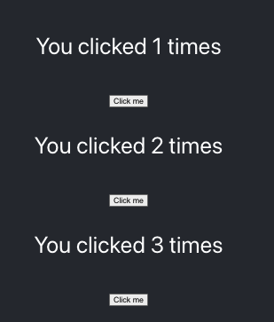
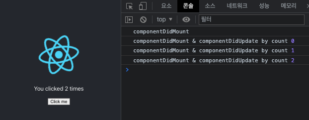
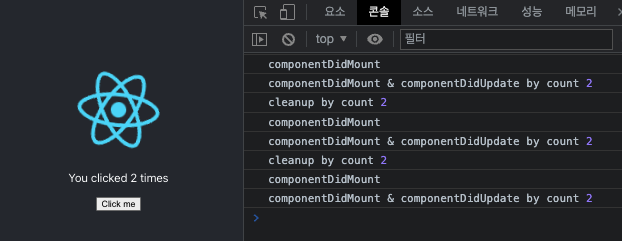

<h1>Ch7. Hooks & Context</h1>

1. Basic Hooks

- Hook (React 16.8 이후 추가)

  - class component에서만 state를 사용하고 라이프사이클을 사용할 수 있었음
  - Hook 개발 이후 function component에서도 사용 가능
  - 컴포넌트의 state와 관련된 로직의 재사용이 가능해졌음

- useState() : state hook : state 대체 가능

  - useState() 이전 : <br/>
    Funtional Component == stateless Component == Stateless Functional Component<br/>

  - useState() 이후 : <br/>
    Funtional Component != stateless Component<br/>

  - useState 개발로 Function Component에서 상태 관리 가능하게 한 이유

    - 컴포넌트 사이의 상태와 관련된 로직의 재사용 어려움
      - 컨테이너 방식이 아닌, 상태와 관련된 로직
    - 복잡한 컴포넌트들은 이해가 어려움
    - class는 사람과 기계를 혼동시킴
      - 컴파일 단계에서 코드를 최적화하기 어렵게 만듦
    - Class Component의 this.state는 로직에서 render() 사이의 레퍼런스를 공유하기때문에 문제 발생 가능
      - render 사이의 변경된 state를 정확하게 표현해야 할때는 좋으나, render 사이의 state를 레퍼런스처럼 사용해야 할때는 좋지 않을 수 있음

  - 적용 예시
    - Example1 : Class Component 사용
    - Example2 : useState()를 활용해 Function Component 사용
    - Example3
      - 방식1 : click()에서 외부 주입받은 state의 count를 변경하여 리턴. 외부 state에 의존적
      - 방식2 : 주입받은 state와 변개의 state를 리턴
      - 방식3 : return을 바로 하므로 (input) => (return) 방식으로 변경

  ```
  /src/compononts/Example1.jsx

  import React from 'react';

  export default class Example1 extends React.Component {
    state = { count: 0 };
    render() {
      const { count } = this.state;

      return (
        <div>
          <p>You clicked {count} times</p>
          <button onClick={this.click}>Click me</button>
        </div>
      );
    }

    click = () => {
      this.setState({ count: this.state.count + 1 });
    };
  }

  ```

  ```
  /src/compononts/Example2.jsx

  import React from 'react';

  // useState => count
  export default function Example2() {
    const [count, setCount] = React.useState(0);
    return (
      <div>
        <p>You clicked {count} times</p>
        <button onClick={click}>Click me</button>
      </div>
    );

    function click() {
      setCount(count + 1);
    }
  }
  ```

  ```
  /src/compononts/Example3.jsx

  import React from 'react';

  // useState => { count: 0 };
  export default function Example3() {
    const [state, setState] = React.useState({ count: 0 });
    return (
      <div>
        <p>You clicked {state.count} times</p>
        <button onClick={click}>Click me</button>
      </div>
    );

    function click() {
      // 방식1과 방식2의 차이는 방식1은 외부의 state에 의존적이지만
      // 방식2는 외부 주입받은 state와는 별개의 state를 리턴하므로
      // 외부 디펜던시에 의존적이지 않다는 장점이 있음
      // 방식3는 방식2와 같으나 return을 바로 할 경우 가능 : (input) => (return)

      // setState({ count: state.count + 1 }); // 방식1

      // 방식2
      // setState((state) => {
      // 	return {
      // 		count: state.count + 1,
      // 	};
      // });

      // 방식3
      setState((state) => ({
        count: state.count + 1,
      }));
    }
  }

  ```

<center>방식별 결과</center>



<br/>

- useEffect() : 라이프사이클 훅의 대체 가능. render와 Dapendency List와 밀접한 관계가 있음

  - 종류

    - componentDidUpdate
    - componentWillUnmount
    - useContext(Context API에서 확인)

  - componentDidMount 처리

    - 방식1 : render 직후 호출
    - 방식2 : count 값을 전달하고자 할때는 3번과 같은 방식으로 사용할 것
    - []는 React.DependencyList를 의미함<br/>
      빈배열 추가 시는 최초 render 직후만 호출

    ```
    /src/components/Example5.jsx

    import React from 'react';

    export default function Example5() {

      const [count, setCount] = React.useState(0);

      // 방식1
      React.useEffect(() => {
        console.log('componentDidMount');
      }, []);

      // 방식2
      React.useEffect(() => {
        console.log('componentDidMount & componentDidUpdate by count', count);
      }, [count]);

      return (
        <div>
          <p>You clicked {count} times</p>
          <button onClick={click}>Click me</button>
        </div>
      );

      function click() {
        setCount(count + 1);
      }
    }

    ```

  <center>방식별 결과1</center>

  

  - componentWillUnmount

    - 1번
      - cleanup : componentDidMount 출력 시점은 렌더가 된 직후이므로 다음 렌더가 실행되기 직전의 시점을 의미
      - componentWillUnmount : 이 케이스는 dependencylist가 없으므로 최초 렌더 시점만 실행되므로 결론적으로 componentWillUnmount 역할을 함
    - 2번
      - cleanup : nextComponentDidupdate가 되기 직전에 정리하는 부분
      - 이 부분의 count는 이전 count로 render 되기 전에 이전 count 값을 출력 후 render 후
        return 위의 componentDidMount & componentDidUpdate by count의 새로운 count 값을 출력한다.

    ```
    /src/components/Example5.jsx

    import React from 'react';

    export default function Example5() {
      const [count, setCount] = React.useState(0);

      // 1번
      React.useEffect(() => {
        console.log('componentDidMount');

        return () => {
          // cleanup
          // componentWillUnmount 역할
        };
      }, []);

      // 2번
      React.useEffect(() => {
        console.log('componentDidMount & componentDidUpdate by count', count);

        return () => {
          // cleanup
          // componentWillUnmount 역할
          console.log('cleanup by count', count);
        };
      }, [count]);

      return (
        <div>
          <p>You clicked {count} times</p>
          <button onClick={click}>Click me</button>
        </div>
      );

      function click() {
        setCount(count + 1);
      }
    }

    ```

    <center>방식별 결과2</center>

    

  - useEffect() 작동방식 추가 설명

    - C : Component
    - R : React
    - B : Browser

    - 첫 번째 Rendering

      1. R -> C : state가 0일 때 UI 생성 지시
      2. C -> R : rendering 결과물 `<p>You clicked {count} times</p>` 전달<br/>
         모든 처리 후 아래 effect 실행 지시<br/>
         () => {document.title = 'You clicked 0 times'}
      3. R -> B : DOM 추가 요청
      4. B -> R : 화면에 DOM 추가
      5. () => {document.title = 'You clicked 0 times'} 이펙트 실행

    - 클릭 후 Rendering

      1. C -> R : 상태 1로 변경 요청
      2. R -> C : 상태 1일 때의 UI 요청
      3. C -> R : rendering 결과물 `<p>You clicked {count} times</p>` 전달<br/>
         모든 처리 후 아래 effect 실행 지시<br/>
         () => {document.title = 'You clicked 1 times'}
      4. R -> B : DOM 추가 요청
      5. B -> R : 화면에 DOM 추가
      6. () => {document.title = 'You clicked 6 times'} 이펙트 실행

    - 이 후 반복

    ```
    /src/Example6.jsx

    import React from 'react';

    export default function Example6() {
      const [count, setCount] = React.useState(0);

      React.useEffect(() => {
        document.title = `You Clicked ${count} times`;
      });

      function click() {
        setCount(count + 1);
      }

      return (
        <div>
          <p>You clicked {count} times</p>
          <button onClick={click}>Click me</button>
        </div>
      );
    }

    ```

<br/><br/>

2. Custom Hooks

- useHasMounted VS withHasMounted

<br/><br/>

3. Additional Hooks

<br/><br/>

4. React Router Hooks

<br/><br/>

5. 컴포넌트간 통신

<br/><br/>

6. Context API

<br/><br/>
